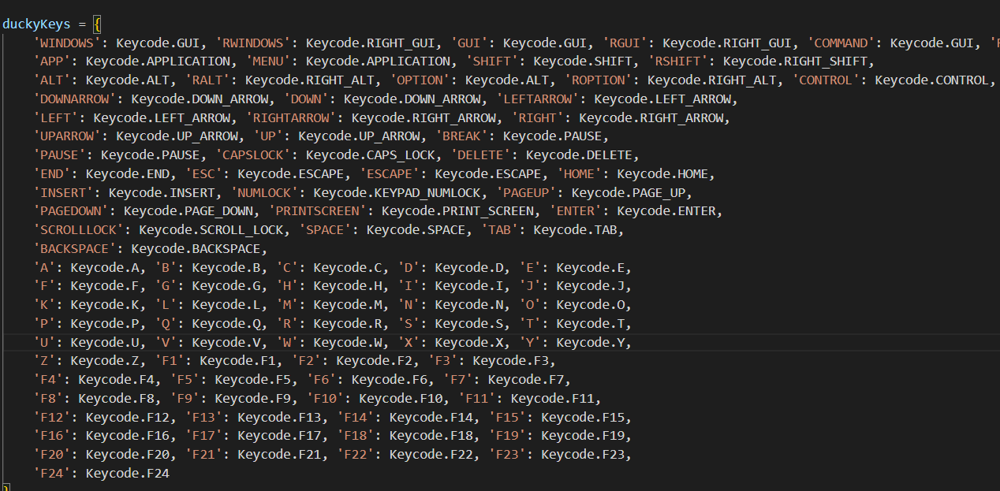

# Raspberry Pi Bad Usb Payload

## Purpose

This directory holds all of the payloads for the ACT Raspberry Pi and Raspberry Pi event 4/7/2025

### How these work
Each Pi will be configured with a payload stored in payload.dd. When writing the payload make sure to start every script with a comment. When uploading them to git use the naming scheme *Hackername_Payload.dd*

```
REM Give a descriptive comment
Payload stuff
```

Using the duckyinpython.py file found in your pi's storage has keywords that map to keyboard keys.




#### Resources
* [Hacker Name Generator](https://www.semanticpen.com/tools/hacker-name-generator)
* [Ducky Scripting Language](https://docs.hak5.org/hak5-usb-rubber-ducky/ducky-script-basics/hello-world)
